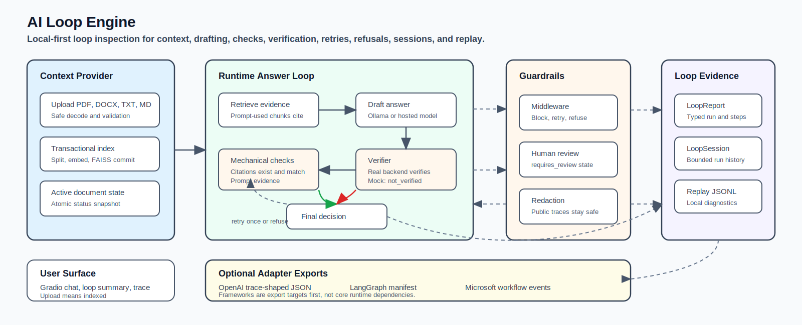

# AI Loop Engine
AI Loop Engine is a local-first engine for inspecting and hardening AI answer
loops: context retrieval, drafting, citation checks, claim verification, retries,
refusals, middleware guardrails, and evals. The current built-in capability is
document context: upload PDF, DOCX, TXT, or MD files, index them with FAISS, and
talk to an agent whose loop is visible and testable.

## Features
- **Loop Engineering Core:** Treats retrieval, drafting, self-checking, retry, refusal, middleware guardrails, and evals as the product surface rather than hidden plumbing
- **Document Context Provider:** Supports PDF, DOCX, and text documents with safe decoding, chunking, and transactional replacement
- **Local-first LLM Backend:** Recommended local path is Ollama; cloud or
  gateway deployment uses a generic OpenAI-compatible chat-completions backend
- **Vector Search:** Uses FAISS for efficient similarity search with Hugging
  local sentence-transformer embeddings; embeddings run on CPU by default on
  Apple Silicon for upload stability
- **Gradio Interface:** Web interface for document context upload, agent chat, runtime status, compact loop summaries, and answer traces
- **GPU/MPS Support:** Automatically utilizes CUDA, Apple Silicon (MPS), or CPU
  for supported local generation paths. Document embeddings use a separate
  device setting.




## Installation

### Prerequisites
- Python 3.11 or 3.12; Python 3.12 is what CI and Docker use
- `uv` for the recommended local workflow ([install guide](https://docs.astral.sh/uv/getting-started/installation/))
- Ollama installed for the recommended local-first setup
- Optional: an OpenAI-compatible model gateway for cloud or remote deployment
  (`/v1/chat/completions` shape)
- Optional legacy path: Hugging Face account/API token only if you deliberately
  use `LLM_BACKEND=endpoint` or `LLM_BACKEND=local` with gated HF models
- At least 8GB RAM if forcing local model execution on CPU; GPU/MPS is strongly preferred for local models

### Local Setup

1. Clone the repository:
    
    ```bash
    git clone https://github.com/dtkmn/ai-loop-engine.git
    cd ai-loop-engine
    ``` 

2. Install dependencies with `uv`:

    ```bash
    uv sync --dev
    ```

   Pip fallback:

    ```bash
    python -m venv venv
    source venv/bin/activate  # On Windows: venv\Scripts\activate
    python -m pip install -r requirements-dev.txt
    ```

3. Run local-first with Ollama:

    Terminal 1, unless the Ollama desktop app/service is already running:

    ```bash
    ollama serve
    ```

    Terminal 2:

    ```bash
    ollama pull nemotron-3-nano:4b
    export LLM_BACKEND=ollama
    export OLLAMA_MODEL=nemotron-3-nano:4b
    export OLLAMA_BASE_URL=http://localhost:11434
    export FAST_MODE=true
    export EMBEDDINGS_DEVICE=cpu
    ```

    `EMBEDDINGS_DEVICE=cpu` is the default on Apple Silicon. Keep it there
    unless you are deliberately testing PyTorch MPS embedding stability.

4. (Optional) choose a different backend:

    Supported values:
    - `ollama` uses a local Ollama server. This is the recommended local path.
    - `auto` tries Ollama and falls back to mock/demo mode if Ollama is not
      available. It does not route to Hugging Face.
    - `openai-compatible` uses any server that implements OpenAI-style
      `/v1/chat/completions`.
    - `endpoint` is the legacy hosted Hugging Face inference backend.
    - `local` is the legacy in-process Transformers backend.
    - `mock` disables real inference for demos/tests.

5. (Optional) set up a cloud or local OpenAI-compatible endpoint:

    ```bash
    export LLM_BACKEND=openai-compatible
    export OPENAI_COMPAT_BASE_URL=http://localhost:8000/v1
    export OPENAI_COMPAT_MODEL=gpt-oss:20b
    export OPENAI_COMPAT_API_KEY=optional_token_here
    ```

    `OPENAI_COMPAT_API_KEY` is optional for local gateways such as vLLM,
    llama.cpp server, LM Studio, or a private proxy. Set it for hosted services
    that require bearer auth. Plain `http://` is accepted only for loopback
    local development; non-loopback endpoints must use `https://`.

6. (Optional legacy) set up Hugging Face endpoint/local model support:

    ```bash
    export HUGGINGFACEHUB_API_TOKEN=your_token_here
    ```

7. (Optional legacy) choose a different Hugging Face local model:

    ```bash
    export LLM_MODEL_ID=Qwen/Qwen2.5-1.5B-Instruct
    ```

8. (Optional) switch back to quality mode:

    ```bash
    export FAST_MODE=false
    ```

9. (Optional) enable debug logs:

    ```bash
    export APP_DEBUG=false
    ```

10. Run the application:

    ```bash
    uv run ai-loop-engine
    ```

    Pip fallback after activating `venv`:

    ```bash
    python -m src.app
    ```
   
## 🐳 Docker Setup

The application is containerized for easy deployment.

### Build the Docker Image

   ```bash
   docker build -t ai-loop-engine .
   ```

### Run the Container

   ```bash
   docker run -p 7860:7860 \
     -e LLM_BACKEND=mock \
     ai-loop-engine
   ```

For a deployed model gateway:

   ```bash
   docker run -p 7860:7860 \
     -e LLM_BACKEND=openai-compatible \
     -e OPENAI_COMPAT_BASE_URL=https://your-gateway.example/v1 \
     -e OPENAI_COMPAT_MODEL=your-model \
     -e OPENAI_COMPAT_API_KEY=optional_token_here \
     ai-loop-engine
   ```

**Note:** `LLM_BACKEND=auto` is local-first and demo-safe: it tries Ollama, then
falls back to mock mode if Ollama is not reachable. Use explicit `ollama` or
`openai-compatible` when you want a real backend to fail closed.


## Usage
1. Open your browser and go to `http://localhost:7860`
2. Upload document context (PDF, DOCX, TXT, or MD; max 25 MB)
3. Click "Index Context" to make it available to the loop
4. Ask questions in the chat interface
5. Inspect the loop summary for the provider, draft count, checks, verifier,
   retry/refusal state, final decision, and last error
6. Open the answer trace when you need the detailed redacted `LoopReport`

## Technical Details

### Loop Contract
- **Current context provider:** Document context
- **Current loop shape:** validate/decode -> split -> embed/index -> retrieve -> draft answer -> run mechanical checks -> verify cited claims -> retry once or fail closed -> return trace/status
- **Context provider boundary:** `DocumentContextProvider` wraps the current
  document vector store and retrieval chain so later providers can plug into the
  loop without changing the product identity again
- **Typed loop primitives:** `src/loop_engine.py` defines provider-neutral `LoopRun`, `LoopStep`, `LoopDecision`, `LoopReport`, `LoopSession`, `LoopPolicy`, `GuardrailDecision`, `LoopMiddleware`, `VerificationResult`, and `HumanReviewRequest`
- **Runtime reports:** `DocumentQA.query_with_trace()` returns a `QueryResult` with both the legacy answer trace and a first-class `LoopReport`
- **Session state:** completed loop reports are retained in bounded in-memory
  `LoopSession` objects keyed by `session_id`
- **Replay artifacts:** local JSONL export writes one raw `LoopReport` per line,
  suitable for future replay and diff tooling
- **Public trace surface:** the Gradio UI shows a compact loop summary plus a
  redacted public loop report; raw reports remain internal diagnostics
- **Middleware boundary:** loop middleware can observe runs/steps, block unsafe progress, request retry/refusal, or mark a human-review pending state without introducing autonomous tool use
- **Framework posture:** OpenAI Agents SDK and LangGraph are dependency-free
  export targets today; Microsoft Agent Framework remains a future export
  target. The adapter strategy lives in
  [`docs/framework-adapter-strategy.md`](docs/framework-adapter-strategy.md).

### Model
- **LLM backend:** Configurable via `LLM_BACKEND`
  - `ollama`: local Ollama server via `OLLAMA_BASE_URL`; recommended for local use
  - `auto` (default): local-first demo path; tries Ollama, then mock fallback
  - `openai-compatible`: OpenAI-style `/v1/chat/completions` endpoint for cloud,
    private gateway, vLLM, llama.cpp server, LM Studio, or similar runtimes
  - `endpoint`: legacy hosted Hugging Face inference
  - `local`: legacy in-process Transformers pipeline
  - `mock`: deterministic demo/test fallback
- **Ollama:** optionally configurable with `OLLAMA_MODEL` (default `nemotron-3-nano:4b`), `OLLAMA_BASE_URL` (default `http://localhost:11434`), and `OLLAMA_TIMEOUT`
- **OpenAI-compatible endpoint:** requires `OPENAI_COMPAT_BASE_URL` and
  `OPENAI_COMPAT_MODEL`; optionally set `OPENAI_COMPAT_API_KEY` and
  `OPENAI_COMPAT_TIMEOUT`
- **Legacy Hugging Face model:** configurable via `LLM_MODEL_ID`
  - **Quality mode (default):** tries `Qwen/Qwen2.5-1.5B-Instruct`, then `Qwen/Qwen2.5-7B-Instruct`, then `meta-llama/Llama-3.2-3B-Instruct`
  - **Fast mode (`FAST_MODE=true`):** tries `Qwen/Qwen2.5-1.5B-Instruct` first, then `meta-llama/Llama-3.2-3B-Instruct`
- **Legacy Hugging Face endpoint:** optionally configurable with
  `HF_ENDPOINT_URL`, `HF_ENDPOINT_TIMEOUT`, and `HUGGINGFACEHUB_API_TOKEN`
- **Embeddings:**
  - **Quality mode:** `Alibaba-NLP/gte-modernbert-base`
  - **Fast mode:** `sentence-transformers/all-MiniLM-L6-v2`
  - **Device:** `EMBEDDINGS_DEVICE=auto|cpu|cuda|mps`. `auto` uses CPU on
    Apple Silicon/MPS to avoid native PyTorch crashes during upload, and CUDA
    when CUDA is available.
- **Vector Store:** FAISS for efficient similarity search
- **Framework:** LangChain for orchestration

### Configuration
- **Response Length:** 384 new tokens (quality) / 160 new tokens (fast)
- **Generation mode:** Deterministic (`do_sample=False`) for more reliable context-grounded answers
- **Chunk Size:** 1200/200 overlap (quality) / 900/120 overlap (fast)
- **Retrieval:** MMR retrieval with source/page grounding
  - **Quality:** `k=6`, `fetch_k=24`
  - **Fast:** `k=3`, `fetch_k=10`
- **Safety limits:** Max upload size 25 MB, chunk cap 2,000 chunks per document
- **Native runtime defaults:** unless you override them, app entrypoints
  bootstrap `OMP_NUM_THREADS`, `MKL_NUM_THREADS`, `OPENBLAS_NUM_THREADS`,
  `VECLIB_MAXIMUM_THREADS`, and tokenizer parallelism before Gradio, NumPy,
  FAISS, or torch load native libraries. Torch threads default to `1` after
  torch import unless `TORCH_NUM_THREADS` is set. This is intentional: upload
  stability beats parallel tensor-loading crashes on local Macs.

## Local-First Direction
- The product direction is **download and run locally first**. Ollama is the
  recommended path for Mac and workstation use because it keeps model setup
  outside the Python dependency graph and avoids requiring cloud credentials.
- Cloud/deployed inference should go through the generic OpenAI-compatible
  backend, not a provider-specific happy path.
- Hugging Face LLM support is now legacy explicit-only. Keep it available while
  existing deployments need it, but do not build new product behavior that
  requires Hugging Face tokens.
- New AI Loop Engine features should not require Hugging Face tokens for the
  happy path. If a feature works locally, document the Ollama path first and the
  OpenAI-compatible deployment path second.
- On Apple Silicon, avoid in-process Hugging Face local weights. Use Ollama for
  local generation and CPU embeddings for document upload stability.

## Loop Engineering Pattern
This repo is intentionally built around three loops:

- **Runtime agent loop:** select context -> retrieve prompt evidence -> draft an
  answer with inline citations -> run mechanical checks -> verify cited claims
  with the active real backend -> retry once or fail closed -> return trace/status.
- **Guardrail loop:** middleware hooks can run before/after runs and steps, and
  can return typed decisions: continue, retry, refuse, block, or requires_review.
- **Engineering loop:** change one contract -> add focused regressions -> run
  golden loop evals -> run broad validation -> ask for review -> stage only
  intentional files.

Golden evals live in `tests/test_golden_document_eval.py` and the CLI lives in
`src/loop_eval.py`. The test suite is provider-free; the CLI can also write a
JSON artifact that includes the loop reports used to score each case:

```bash
uv run python -m src.loop_eval --mode fake --artifact artifacts/loop-eval.json
uv run pytest tests/test_golden_document_eval.py -q
uv run pytest tests/test_loop_eval.py -q
uv run pytest
```

Use these before adding planner loops, tools, multi-context memory, or more
agent-like behavior. Blunt rule: if the boring single-agent loop is not
measurably honest, bigger agent features will only make the failure harder to see.

### Framework Adapter Strategy

Frameworks are interop surfaces, not the engine. The current plan is to export
AI Loop Engine reports into framework-shaped artifacts before adding any live
framework runtime integration:

- OpenAI Agents SDK: trace-shaped export, dependency-free in
  `src.adapters.openai_trace`
- LangGraph: thread/checkpoint manifest export, dependency-free in
  `src.adapters.langgraph_manifest`
- Microsoft Agent Framework: workflow event-stream export first, not yet
  implemented

See [`docs/framework-adapter-strategy.md`](docs/framework-adapter-strategy.md)
for mappings, non-goals, and the dependency boundary.

Export a report or session locally when you need framework-shaped JSON for
inspection or downstream tooling:

```python
from src.adapters.openai_trace import export_report, export_session
from src.adapters.langgraph_manifest import export_session as export_langgraph_session

trace_payload = export_report(query_result.loop_report)
session_payload = export_session(qa_system.loop_session("default"))
langgraph_payload = export_langgraph_session(qa_system.loop_session("default"))
```

These helpers do not import the OpenAI Agents SDK, call OpenAI APIs, or mutate
the original loop reports. They also do not import or execute LangGraph.
Public/redacted export is the default; use `public=False` only for local
diagnostics you are willing to treat as sensitive.

Use the local export CLI when starting from a JSONL replay artifact:

```bash
uv run python -m src.loop_export \
  --adapter openai-trace \
  --input artifacts/loop-session-default.jsonl \
  --output artifacts/openai-trace.json

uv run python -m src.loop_export \
  --adapter langgraph-manifest \
  --input artifacts/loop-session-default.jsonl \
  --output artifacts/langgraph-manifest.json
```

The CLI defaults to public/redacted output. `--raw` is intentionally explicit
because raw loop reports can contain prompts, retrieved excerpts, drafts,
verifier payloads, and final answers.

### Local Replay Artifacts

`DocumentQA` keeps recent loop reports in memory per `session_id`. Export a
session locally when you need a replay/debug artifact:

```python
qa_system.export_loop_session_jsonl("artifacts/loop-session-default.jsonl")
```

Each JSONL line is a raw `loop-report/v1` object. Treat these files as local
developer diagnostics because they may include prompts, retrieved excerpts, draft
outputs, and final answers. Planned replay/diff commands should look like:

```bash
uv run python -m src.loop_replay inspect artifacts/loop-session-default.jsonl
uv run python -m src.loop_replay diff before.jsonl after.jsonl
```

Those commands are intentionally not implemented yet. The report shape needs to
stay stable before replay becomes a real product surface.

### Optional Live Ollama Model Eval

CI stays provider-free. When you want to compare a pulled local Ollama model,
run the unified loop eval command manually. Each case performs answer and
verifier calls, so start with one model and one case on memory-constrained Macs.
The live eval command only accepts loopback Ollama URLs such as
`http://localhost:11434` or `http://127.0.0.1:11434`; it is not an arbitrary
remote model benchmark tool.

```bash
uv run python -m src.loop_eval \
  --mode ollama \
  --models nemotron-3-nano:4b \
  --case launch_date \
  --timeout 30 \
  --artifact artifacts/loop-eval-ollama-launch.json \
  --no-fail
```

Then run the full golden set for one model:

```bash
uv run python -m src.loop_eval \
  --mode ollama \
  --models nemotron-3-nano:4b \
  --all-cases \
  --timeout 60 \
  --artifact artifacts/loop-eval-ollama-full.json \
  --no-fail
```

Score the artifacts by loop evidence: phases, citations, verifier decisions,
retry/refusal state, and final decision. Do not judge models by answer text
alone.

The command refuses multiple Ollama models by default so a comparison run does not
accidentally overload a local Mac. Prefer one model per command. Only use the
override when you have enough free unified memory and are comfortable watching
resource pressure:

```bash
uv run python -m src.loop_eval \
  --mode ollama \
  --models nemotron-3-nano:4b qwen3:8b \
  --allow-multi-model \
  --all-cases \
  --timeout 60 \
  --artifact artifacts/loop-eval-ollama-compare.json \
  --no-fail
```

The command asks Ollama to unload each model after its run by default. If your
machine still feels memory pressure, stop the run and inspect resident models:

```bash
ollama ps
ollama stop nemotron-3-nano:4b
ollama stop qwen3:8b
```

## Security and Dependency Maintenance
- Dependencies are declared in `pyproject.toml` and locked in `uv.lock` for the
  recommended local workflow.
- `requirements.txt` and `requirements-dev.txt` remain pip-compatible exports
  for Docker, Hugging Face Spaces, and conservative CI paths. Tests assert they
  stay synchronized with `pyproject.toml`.
- Dependabot is enabled weekly (`.github/dependabot.yml`) for dependency updates.
- Current baseline includes Gradio `6.15.2`, LangChain `1.3.10`,
  LangChain-HuggingFace `1.2.1` for embeddings/legacy HF paths,
  HuggingFace Hub `1.5.0`, Transformers `5.4.0`, and Torch `2.12.1`.
- Note: `marshmallow` is intentionally pinned to `3.26.2` because `dataclasses-json` currently requires `<4.0.0`.
- Security-sensitive transitive dependencies are explicitly pinned (for example `aiohttp`, `urllib3`, `python-multipart`, and `orjson`) to keep audit results stable.
- Recommended recurring checks:

  ```bash
  uv sync --dev
  uv lock --check
  uv run pytest tests/test_loop_engine.py -q
  uv run pytest tests/test_golden_document_eval.py -q
  uv run pytest tests/test_loop_eval.py -q
  uv run pytest tests/test_ollama_model_eval.py -q
  uv run pytest
  uv run python -m pip_audit -r requirements.txt --strict
  uv run python -m pip check
  ```

## Agent-Assisted Development
- `AGENTS.md` contains repo-level instructions for coding agents: setup commands,
  validation expectations, backend honesty rules, encoding policy, and release
  guardrails.
- `.agents/skills/document-qa/SKILL.md` defines the focused loop-engineering
  skill for changes to loop contracts, document context, retrieval, model
  routing, UI status, evals, and CI publishing.
- Use the documented loop for non-trivial changes: explore, plan, act, observe,
  verify, review, and ship.

## Contributing
Feel free to submit issues and pull requests. Contributions are welcome!

## License
This project is open source and available under the MIT License.
